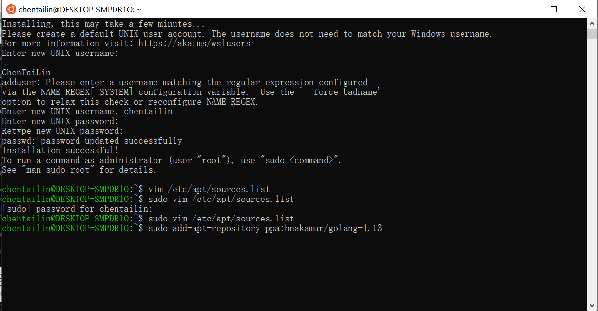
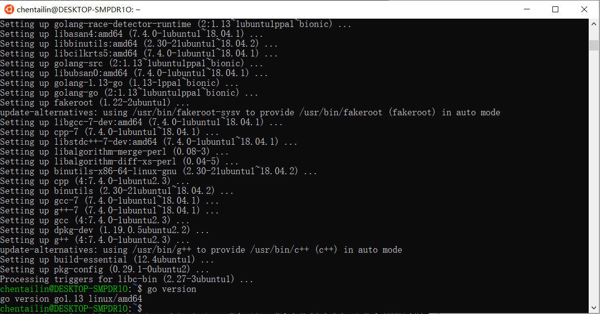
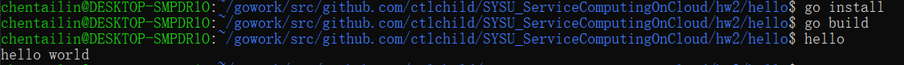
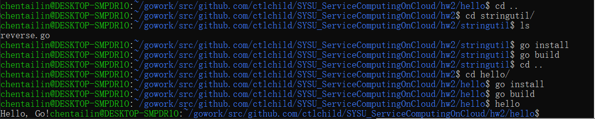
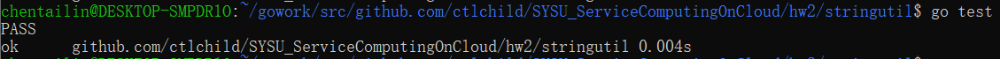

# 安装 go 语言开发环境

> 数据科学与计算机学院 17343012 陈泰霖

### 1. 安装 golang

为了避免使用虚拟机时经常出现的卡顿现象，我使用了Windows 10内置的Ubuntu子系统，并使用VS Code的WSL技术连接Ubuntu。

直接使用Ubuntu终端命令下载golang版本是1.10的，我用了另外的一种方法下载了golang-1.13

首先直接使用官方网站的源下载速度太慢，我把源改成了清华的镜像站。

在终端中输入`sudo vim /etc/apt/sources.list`，将文本内容改成

```notepad
deb https://mirrors.tuna.tsinghua.edu.cn/ubuntu/ bionic main restricted universe multiverse
deb https://mirrors.tuna.tsinghua.edu.cn/ubuntu/ bionic-updates main restricted universe multiverse
deb https://mirrors.tuna.tsinghua.edu.cn/ubuntu/ bionic-backports main restricted universe multiverse
deb https://mirrors.tuna.tsinghua.edu.cn/ubuntu/ bionic-security main restricted universe multiverse
```

在终端中输入`sudo add-apt-repository ppa:hnakamur/golang-1.13` 以获得 Go 1.13。



在终端中输入`sudo apt install golang-go`安装golang，安装后再终端中输入`go version`可以看到当前golang的版本。



可以看到安装了1.13版本的golang。

### 2.设置环境变量

首先创建一个工作空间目录，并设置相应的GOPATH。

在终端中输入`mkdir -p ~/gowork `创建工作空间目录，然后修改`/etc/profile`中的内容来修改环境变量，增加下列内容：

```
export GOPATH=~/gowork
export PATH=$PATH:$GOPATH/bin
```

### 3.创建第一个go程序

 在终端中输入`mkdir hello`创建目录，然后在这个目录下创建文件`hello.go`文件，输入下列代码：

```go
package main

import (
	"fmt"
)

func main() {
	fmt.Printf("hello world\n")
}
```

在终端中输入

```
go install
go build
hello
```

就可以看到运行结果了

### 

### 4.创建第一个库

在终端中输入`mkdir stringutil`创建目录，然后在这个目录下创建`reverse.go`文件，输入以下代码：

```go
// stringutil 包含有用于处理字符串的工具函数。
package stringutil

// Reverse 将其实参字符串以符文为单位左右反转。
func Reverse(s string) string {
	r := []rune(s)
	for i, j := 0, len(r)-1; i < len(r)/2; i, j = i+1, j-1 {
		r[i], r[j] = r[j], r[i]
	}
	return string(r)
}
```

然后输入`go install`与`go build`，将原来的`hello.go`中的内容修改为：

```go
package main

import (
	"fmt"

	"github.com/ctlchild/SYSU_ServiceComputingOnCloud/hw2/stringutil" 
)

func main() {
	fmt.Printf(stringutil.Reverse("!oG ,olleH"))
}
```

运行可以得到预想的结果。



### 5.测试

Go拥有一个轻量级的测试框架，它由 `go test` 命令和 `testing` 包构成。

可以通过创建一个名字以 `_test.go` 结尾的，包含名为 `TestXXX` 且签名为 `func (t *testing.T)` 函数的文件来编写测试。 测试框架会运行每一个这样的函数；若该函数调用了像 `t.Error` 或 `t.Fail` 这样表示失败的函数，此测试即表示失败。

创建`reverse_test.go`为`stringutil`添加测试，内容如下：

```go
package stringutil

import "testing"

func TestReverse(t *testing.T) {
	cases := []struct {
		in, want string
	}{
		{"Hello, world", "dlrow ,olleH"},
		{"Hello, 世界", "界世 ,olleH"},
		{"", ""},
	}
	for _, c := range cases {
		got := Reverse(c.in)
		if got != c.want {
			t.Errorf("Reverse(%q) == %q, want %q", c.in, got, c.want)
		}
	}
}
```

然后用`go test`运行该测试




