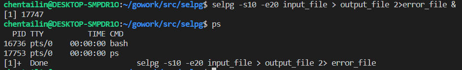

## CLI 命令行实用程序开发基础

> 数据科学与计算机学院 17343012 陈泰霖

这次实践我将用go语言实现CLI命令行的一个实用程序——selpg，代表SELect PaGes，它允许用户指定从输入文本中抽取一定范围的页并打印，输入文本可以来自文件或是另一个进程。

### 代码实现

首先import一些需要用到的包

```go
package main

import (
	"fmt"
	"io"
	"math"
	"os"
	"os/exec"
	"bufio"
	"github.com/spf13/pflag"
)
```

其中`"github.com/spf13/pflag"`是为了使用pflag。

定义结构体`selpg_args`，我们的操作都是基于这个结构体

```go
type selpg_args struct{
	stpg int
	edpg int
	input_filename string
	pglen int	
	pgtype string	
	print_dest string	
}
```

pflag的初始化和用例：

```go
func usage() {
	fmt.Fprintf(os.Stderr, "Usage of %s:\n", os.Args[0])
	fmt.Fprintf(os.Stderr, os.Args[0]+" -sstart_page_num -eend_page_num [ -f | -llines_per_page ] [ -ddest ] [ input_filename ]\n")
    pflag.PrintDefaults()
}

func Init(args *selpg_args){
	pflag.Usage = usage
    pflag.IntVarP(&(args.stpg), "start", "s", -1, "start page")
    pflag.IntVarP(&(args.edpg), "end", "e", -1, "end page")
	pflag.IntVarP(&(args.pglen), "line", "l", 72, "page lines")
	pflag.StringVarP(&(args.pgtype), "type", "f", "l", "type of print")
    pflag.StringVarP(&(args.print_dest), "destination", "d", "", "print destination")
}
```

pflag能够访问命令行，将用户输入的参数转化为结构体中的成员变量

然后是`check`函数，对于用户输入不合法的情况进行报错和提示，包括了是参数不够，起始页，终止页，每页行数不合法（过小或过大），换页类型（遇到"/f"换页或固定行数）不合法，逻辑简单，比较繁杂，代码不再赘述。

然后是处理的主体部分

首先定义了`fin，fout，finBuffer`分别表示读入方式，输出方式，以及对于读入方式的一个`*Reader`，之后就是根据换页方式对输入进行处理并输出

```go
if args.pgtype == "l" {
    line_ctr := 0
    page_ctr := 1
    for {
        line,  crc := finBuffer.ReadString('\n')
        if crc != nil {
            break
        }
        line_ctr ++
        if line_ctr > args.pglen {
            page_ctr ++
            line_ctr = 1
        }

        if (page_ctr >= args.stpg) && (page_ctr <= args.edpg) {
            _, err := fout.Write([]byte(line))
            if err != nil {
                fmt.Fprintf(os.Stderr, "ERROR!", err)
                os.Exit(1)
            }
        }
    }  
}else{
    page_ctr := 1
    for{

        page,  crc := finBuffer.ReadString('\f')
        if crc != nil {
            break
        }
        page_ctr ++
        if ( (page_ctr >= args.stpg) && (page_ctr <= args.edpg) ){
            _, err := fout.Write([]byte(page))
            if err != nil {
                fmt.Fprintf(os.Stderr, "ERROR!", err)
                os.Exit(1)
            }
        }
    }
}
```


### 功能测试

首先需要用到pflag

在终端中输入

>go get github.com/spf13/pflag

在不加任何参数下执行：

在终端中输入

>selpg


可以看到出现了参数不够的错误提示，需要加上参数-s -e 表示起始页和终止页，有可选参数-f或-l表示以\f换行或是固定行数换行，可选参数-d表示打印目的地，一般是打印机，还需要输入打印的输入文件。

接下来对selpg功能进行测试：

测试文件`input_file`中是从1到8000的8000个数，每个数一行。

1. >$ selpg -s1 -e1 input_file

该命令将把“input_file”的第 1 页写至标准输出（也就是屏幕），因为这里没有重定向或管道。


在屏幕上结果最后部分如上图，表示确实打印了72行（默认行数）

2. > $ ls | selpg -s1 -e20

“ls” 的标准输出被 shell／内核重定向至 selpg 的标准输入。将第 10 页到第 20 页写至 selpg 的标准输出（屏幕）。


4. > $ selpg -s1 -e20 input_file >output_file

selpg 将第 1 页到第 20 页写至标准输出；标准输出被 shell／内核重定向至“output_file”。


可以看到输出文件最后5行的结果，结果符合预期

5. > $ selpg -s10 -e20 input_file >output_file 2>error_file

selpg 将第 10 页到第 20 页写至标准输出，标准输出被重定向至“output_file”；selpg 写至标准错误的所有内容都被重定向至“error_file”。当“input_file”很大时可使用这种调用；您不会想坐在那里等着 selpg 完成工作，并且您希望对输出和错误都进行保存。


没有发生错误，所以`error_file`的行数为0，`output_file`的行数也是正确的。

6. >$ selpg -s10 -e20 input_file >output_file 2>/dev/null

selpg 将第 10 页到第 20 页写至标准输出，标准输出被重定向至“output_file”；selpg 写至标准错误的所有内容都被重定向至 /dev/null（空设备），这意味着错误消息被丢弃了。设备文件 /dev/null 废弃所有写至它的输出，当从该设备文件读取时，会立即返回 EOF。


7. >selpg -s10 -e20 input_file >/dev/null

selpg 将第 10 页到第 20 页写至标准输出，标准输出被丢弃；错误消息在屏幕出现。这可作为测试 selpg 的用途，此时您也许只想（对一些测试情况）检查错误消息，而不想看到正常输出。


没有显示结果，但是错误的时候会显示错误信息。

8. >$ selpg -s10 -e20 input_file | other_command

selpg 的标准输出透明地被 shell／内核重定向，成为“other_command”的标准输入，第 10 页到第 20 页被写至该标准输入。“other_command”的示例可以是 lp，它使输出在系统缺省打印机上打印。“other_command”的示例也可以 wc，它会显示选定范围的页中包含的行数、字数和字符数。“other_command”可以是任何其它能从其标准输入读取的命令。错误消息仍在屏幕显示。


9. >$ selpg -s10 -e20 -l66 input_file

该命令将页长设置为 66 行，这样 selpg 就可以把输入当作被定界为该长度的页那样处理。第 10 页到第 20 页被写至 selpg 的标准输出（屏幕）。


屏幕上最后几行的输出结果符合预期

10. > $ selpg -s10 -e20 input_file > output_file 2>error_file &

该命令利用了 Linux 的一个强大特性，即：在“后台”运行进程的能力。在这个例子中发生的情况是：“进程标识”（pid）如 1234 将被显示，然后 shell 提示符几乎立刻会出现，使得您能向 shell 输入更多命令。同时，selpg 进程在后台运行，并且标准输出和标准错误都被重定向至文件。这样做的好处是您可以在 selpg 运行时继续做其它工作。

您可以通过运行命令 ps（代表“进程状态”）检查它是否仍在运行或已经完成。该命令会显示数行信息，每行代表一个从该 shell 会话启动的进程（包括 shell 本身）。如果 selpg 仍在运行，您也将看到表示它的一项信息。您也可以用命令“kill -l5 1234”杀死正在运行的 selpg 进程。如果这不起作用，可以尝试用“kill -9 1234”



11. >$ selpg -s10 -e20 -f f input_file

假定页由换页符定界。第 10 页到第 20 页被写至 selpg 的标准输出（屏幕）。


### 